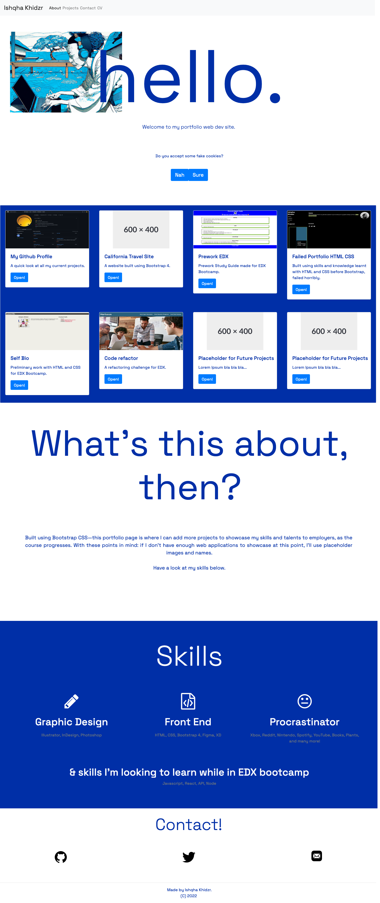

# Week 03 Challenge: Portfolio for Course (using Bootstrap CSS)

A web dev portfolio page where I can add more projects to showcase my skills and talents to employers, as the course progresses. 

Compared to previous week's challenge, this one is built using Bootstrap CSS frameworks.

With these points in mind, if I don't have enough web applications to showcase at this point, I'll use placeholder images and names. 

## Description

This project takes on the 3rd week challenge which is creating a (better looking) portfolio page for this bootcamp.

This is for practicing the things I've learned and to apply the skills during the 2nd and 3rd module.

### Essential information

## Links/Submission

* REPO: https://github.com/i-k-dev/challenge-week-02
* PAGE: https://i-k-dev.github.io/bootstrap-portfolio/

## Acceptance Criteria

Critical requirements necessary to develop a portfolio that satisfies a typical hiring manager’s needs:

* A Navigation bar. ✅
* A navigation menu at the top. ✅
* Include links that are applicable to your portfolio. ✅
* Links should navigate to the appropriate sections. ✅

* A hero section. ✅
* A jumbotron featuring your picture, your name, and any other information you'd like to include. 🧐/✅

* A work section. ✅
* A section displaying your work in grid. ✅
* If you need to use placeholder image use: https://placehold.co/ ✅
* Use bootstrap cards for each project. ✅
* The description should give a brief overview of the work. ✅
* Each project will eventually link to your class project work! ✅

* A skills section. ✅
* List out the skills you expect to learn from the bootcamp. ✅

* An about / contact section. ✅
* An "About Me" section in the same row. ✅

* A footer section. ✅
* All hyperlinks should have a hover effect. ✅
* All buttons should display a box shadow upon hover. 🧐/✅

* Your Bootstrap solution should minimize use of media queries. ✅
* Deploy your new Bootstrap-powered portfolio to GitHub Pages. ✅

## Screenshots

Preview of whole site:

## Author

Contributor names and contact info

Ishqha Khidzr  
@ this-github-user :-)

## Thanks